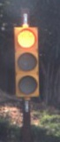
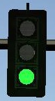
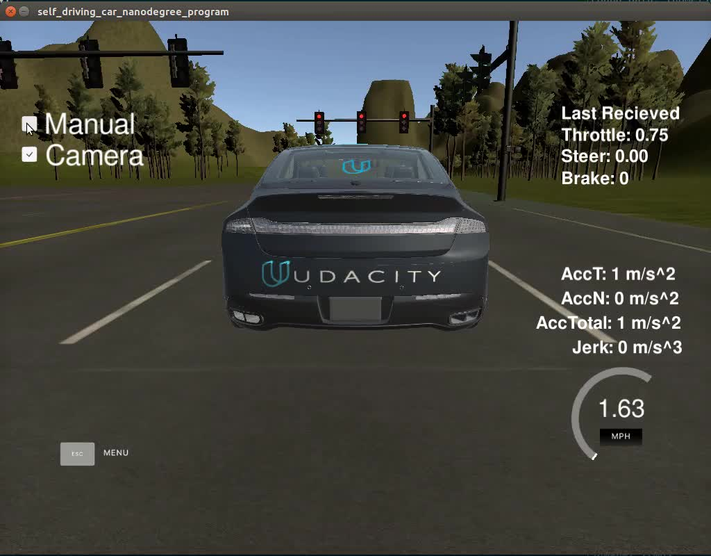
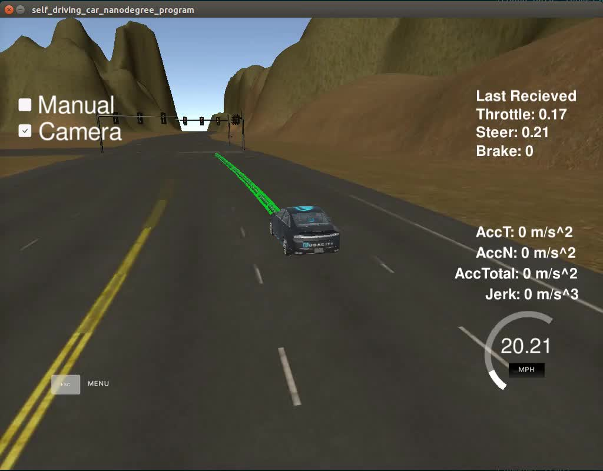
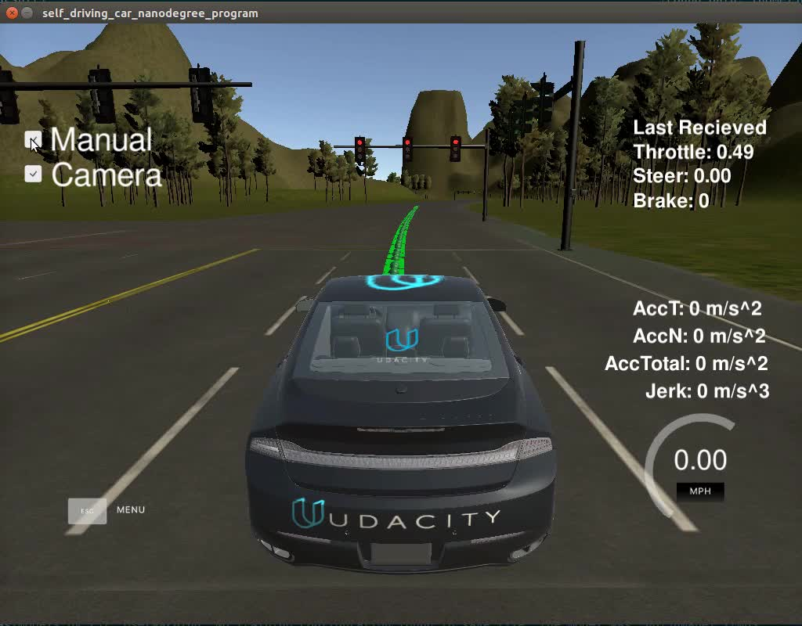

# **Self-Driving Car Nanodegree Capstone Project**

### Using ROS to program a real self-driving car

---

**Team Members**

| Name                 | Email                            | Slack Handle     | Node             |
|:--------------------:|:--------------------------------:|:----------------:|:----------------:|
| Nathan Greco         | nathan.greco@gmail.com           | @nategreco       | waypoint_updater |
| Charles Faivre       | chuck@ratsnestinc.com            | @cpfaivre        | dbw_node, twist_controller        |
| John Novotny         | john.novotny@gmail.com           | @jnovotny        | system integration                 |
| Mohamed Hussien      | eng.mohamedhussien1991@gmail.com | @mohamed_hussien | tl_detector      |
| Virendra Kumar Anand | vkanand1976@gmail.com            | @vkanand         | tl_classifier    |

**Capstone Project Goals**

The goals / steps of this project are the following:

* Smoothly follow waypoints in the simulator.
* Respect the target top speed set for the waypoints' 'twist.twist.linear.x' in 'waypoint_loader.py'. Be sure to check that this is working by testing with different values for kph velocity parameter in '/ros/src/waypoint_loader/launch/waypoint_loader.launch'. If your vehicle adheres to the kph target top speed set here, then you have satisfied this requirement.
* Stop at traffic lights when needed.
* Stop and restart PID controllers depending on the state of '/vehicle/dbw_enabled'.
* Publish throttle, steering, and brake commands at 50hz.
* Launch correctly using the launch files provided in the capstone repo. **Please note that we will not be able to accomodate special launch instructions or run additional scripts from your submission to download files.** The 'launch/styx.launch' and 'launch/site.launch' files will be used to test code in the simulator and on the vehicle respectively. The submission size limit for this project has been increased to 2GB.

[//]: # (Image References)
[image1]: ./imgs/WaypointEq1.png "Kinematic Equation"
[image2]: ./imgs/WaypointEq2.png "Rearranged for stopping distance"
[image3]: ./imgs/WaypointEq3.png "Rearranged for profiling velocity"
[video1]: ./start_snippet.mp4 "Start to green light"
[video2]: ./stop_snippet.mp4 "Stop at red light"
[video3]: ./loop_sim.mp4  "Full Car loop in simulator"

---

### Discussion

#### 1. Implementation

##### a. Waypoint Updater

The waypoint updater was completed in two parts.  An initial partial implementation was completed so that other nodes could begin development, then later in the project a full implementation was done.

The partial implementation accomplishes the following:
* Implements the following subscribers(s)
  * `/current_pose` with callback `pose_cb()`
  * `/base_waypoints` with `waypoints_cb()`
  * `/traffic_waypoint` with `traffic_cb()`
  * `/current_velocity` with `velocity_cb()`
* Implements the following publisher(s)
  * `/final_waypoints` with `get_publish_data()`
* Finds nearest waypoint to current pose with `get_nearest_waypoint()`
* Profiles waypoint velocity with `get_new_vel()`
* Gets new waypoint list to publish with `get_waypoints()`

The full implementation added the additional feature(s):
* Checks for a `/traffic_waypoint` along the vehicle path
* Re-profiles waypoint velocities for stopping at traffic lights

The following variables were defined as tunable values:
* `LOOKAHEAD_WPS = 100         # waypoints`
* `LOOP_RATE = 1               # hz`
* `MAX_SPD = 20.0 * 0.44704    # m/s`
* `ACCEL = 1.0                 # m/s^2`
* `DECEL = 1.0                 # m/s^2`
* `STOP_AHEAD = 3.0            # m`

Summary of functionality:
On a cyclic basis of `LOOP_RATE`, the `/final_waypoints` publisher publishes the result of method `get_publish_data()`. `get_publish_data()` only constructs the `lane` object for the publisher, by creating the header and appending it with the data from `get_waypoints()`.  `get_waypoints()` does most of the heavy lifting, first determining the nearest waypoint with `get_nearest_waypoint()`, which finds the nearest waypoint that is ahead, requiring the implementation of `check_waypoint_behind()`.  Once the nearest waypoint is found, the range of indices of the `/base_waypoints` that span the length of `LOOKAHEAD_WPS` is copied to the `wps` object, however no velocity profiling is done.  Also here, special care is taken in the edge case where the lookahead points span across the last and first waypoint.

Once the waypoints are created, velocity profiling is needed.  This is where the partial and full implementation can be differentiated.  In the partial, we profile velocity to `MAX_SPD` with `get_new_vel()` and we are done.  The full implementation kept this, but afterwards checked for a traffic light in the range of our lookahead waypoints.  Profiling of all the velocities relied heavily on the following Kinematic Equation:

![Kinematic Equation][image1]

First, the equation was rearranged to calculate stopping distance, like so:

![Rearranged for stopping distance][image2]

This allowed us to keep the profile velocity up until that set distance from the `/traffic_waypoint`.  At that point, we invoked `get_new_vel()` and used the following arrangement of the kinematic equation:

![Rearranged for profiling velocity][image3]

This would provide the proper constant decel profiling we wanted over the distance between waypoints.  Once profiled to a stop, the loop would hold that velocity at zero for the remainder of the waypoints and until the `/traffic_waypoint` value was clear, at which point we'd begin ramping up the velocity again.

##### b. DBW Node
DBWNode is a ROS node that is responsible for taking twist_cmd data published from the Waypoint Follower ROS node, and information from the car/simulator from ROS topics:

`/twist_cmd`          -- twist command stream from Waypoint Follower
`/current_velocity`   -- current velocity of the vehicle
`/dbw_enabled`        -- drive by wire system enabled

This ROS node publishes topics for brake control, steering, and throttle:

`/vehicle/steering_cmd`   -- steering control to vehicle
`/vehicle/throttle_cmd`   -- throttle control to vehicle
`/vehicle/brake_cmd`      -- brake control to vehicle in N*m

The control data is provided by the twist controller at a cycle rate of 50 per second. If dbw_enabled, the car/simulator will take the control data and operate the vehicle

##### c. Twist Controller

ToDo

##### d. Traffic Light Detector

Traffic Light Detector is the node that responsible for:
* Detect the traffic light from the image captured by camera
* Send the detected traffic light to tl_classifier function to classify it
* Publish the traffic light state and location

This node subscribes to four topics:
* `/base_waypoints` provides the complete list of waypoints for the course.
* `/current_pose` can be used to determine the vehicle's location.
* `/image_color` which provides an image stream from the car's camera. These images are used to determine the color of upcoming traffic lights.
* `/vehicle/traffic_lights` provides the (x, y, z) coordinates of all traffic lights.

This node publishes the index of the waypoint for nearest upcoming red light's stop line to a single topic:
* `/traffic_waypoint`

What I did:
* I implemented `get_closest_waypoint` function to use it to get the nearest front waypoints to the car, the nearest traffic light and the nearest stop line
* I implemented `process_traffic_lights` function to get the nearest traffic light and its stop line and returns the traffic light state and its stop line location
* I implemented `get_light_state` function to detect the traffic light from the image and sends the detected one to the classifier

Info about the detection model:
* I used the tiny_YOLO_v2 architecture as it's suitable for real time applications
* The model consists of 9 convolutional layers
* I used the pretrained model on COCO dataset as it already has a traffic_light class
* I used the weights provided by the dark_net from this but I got nans as result of any input, And when I got inside the weights file I found a zero was added by fault to the beginning to the file, So I removed it and became the first one to be able to use this pretrained model
* I used non-maximum-suppression on the resulted tensor to get the detection boxes of the wanted class
* The file `object_detection.ipynb` of Building the architecture and loading the weights is in `yolo detector model` folder

Here are some results of the detection model: 

* For more examples check the `yolo detector model` folder

##### e. Traffic Light Classifier

Traffic Light Classifier

Traffic light classifier is responsible for classifying the passed images as Red, Green or Yellow state of traffic light. Traffic light detector module detects an object as traffic light and saves the image of detected traffic light. It calls Traffic light classifier and passes the image of detected traffic light and gets back a label corresponding to the color state of the traffic light. Traffic light is a re-trained Inception classifier on the traffic light images extracted from Bosch Small Traffic Lights Dataset. Different size and brightness images were used for the training. Also some of the images were little angled. The inception classifier as explained in below github has been used for 5000 steps.

 https://github.com/llSourcell/tensorflow_image_classifier

After the end of 5000 steps, the training process resulted in training accuracy of 91.2% and validation accuracy of 93%. After that few random images of traffic signs were passed that gave below results.

|Image   | Actual Color   |  Predicted  | Probability of Prediction   |  Comment    |
|:------:|:--------------:|:-----------:|:---------------------------:|:----------:|  
|| Yellow | Yellow |0.76714|	|
|| Red    | Red    |0.67141| |
|| Red    | Red    |0.58037| |
|| Yellow | Red    |0.53224| |
|| Green  | Green  |0.7778 |Picked up safer option.|
|| Green | Red    |0.38152|No clear winner, slightly inclined towards red.|
|| Green| Green  |0.67349| |
|| Yellow| Yellow |0.5037| |
|| Yellow| Red |0.48372|No clear winner, slightly inclined towards red. |
|| Red| Yellow |0.41307|No clear winner. Picked up Yellow instead of Red.|
|| Green| Green |0.960062||
|| Green| Green |0.84519||
|| Green| Green |0.74188||
|| Yellow| Red |0.42038|No clear winner, slightly inclined towards red.|

The above shows that in the simulator images, Yellow was mostly picked as Red which is safer option. To speed up the inference process, model was loaded only once during when TLClassifier object was created. In case the inference was giving probability of less than 50% on any image then that detection was not considered as good and defaulted to red light detection for a safer option.

The light classifier runs in less than 30ms on a GTX 1070 Nvidia GPU.

#### 2. Results

The following three videos show two snippets from simulation results.  The first video shows the start of the car start and the subsequent
stop at the first light, then subsequently the car proceeding when it sees a green light.

The next video shows our car making a full stop at a red light from a starting point of it's steady state speed (20 mph).

Finally we have included a video of the complete first loop around the track.  Which shows our end to end performace on the simulation loop.

